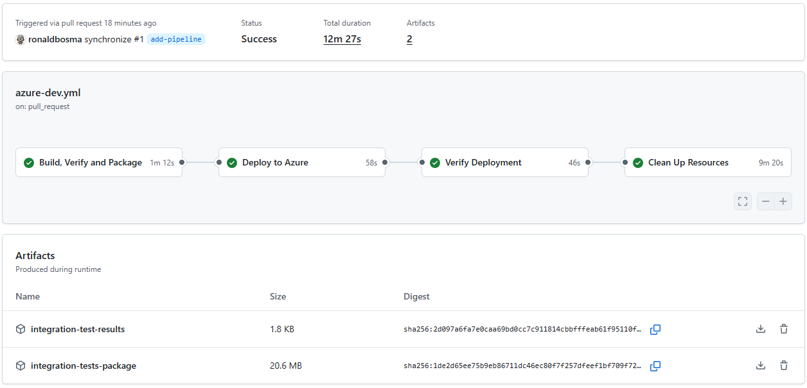
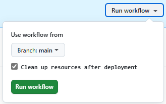

# mTLS with Azure API Management

> [!WARNING]  
> This template is under construction


> TODO intro

> [!IMPORTANT]  
> This template is not production-ready; it uses minimal cost SKUs and omits network isolation, advanced security, governance and resiliency. Harden security, implement enterprise controls and/or replace modules with [Azure Verified Modules](https://azure.github.io/Azure-Verified-Modules/) before any production use.

## Getting Started

### Prerequisites

Before you can deploy this template, make sure you have the following tools installed and the necessary permissions.

**Required Tools:**

- [Azure Developer CLI (azd)](https://learn.microsoft.com/en-us/azure/developer/azure-developer-cli/install-azd)
  - Installing `azd` also installs the following tools:
    - [GitHub CLI](https://cli.github.com)
    - [Bicep CLI](https://learn.microsoft.com/en-us/azure/azure-resource-manager/bicep/install)

**Required Permissions:**

- You need **Owner** permissions, or a combination of **Contributor** and **Role Based Access Control Administrator** permissions on an Azure Subscription to deploy this template.

**Optional Prerequisites:**

To build and run the [integration tests](#integration-tests) locally, you need the following additional tools:

- [.NET 10 SDK](https://dotnet.microsoft.com/en-us/download/dotnet/10.0)

### Deployment

Once the prerequisites are installed on your machine, you can deploy this template using the following steps:

1. Run the `azd init` command in an empty directory with the `--template` parameter to clone this template into the current directory.

   ```cmd
   azd init --template ronaldbosma/mtls-with-apim
   ```

   When prompted, specify the name of the environment, for example, `mtlsapim`. The maximum length is 32 characters.

1. Run the `azd auth login` command to authenticate to your Azure subscription using the **Azure Developer CLI** _(if you haven't already)_.

   ```cmd
   azd auth login
   ```

1. Run the `azd up` command to provision the resources in your Azure subscription.

   ```cmd
   azd up
   ```

   See [Troubleshooting](#troubleshooting) if you encounter any issues during deployment.

1. Once the deployment is complete, you can locally modify the application or infrastructure and run `azd up` again to update the resources in Azure.

### Demo

See the [Demo Guide](demos/demo.md) for a step-by-step walkthrough on how to check and demonstrate different mTLS scenarios with API Management.

### Clean up

Once you're done and want to clean up, run the `azd down` command. By including the `--purge` parameter, you ensure that the API Management service and Log Analytics workspace don't remain in a soft-deleted state, which could cause issues with future deployments of the same environment.

```cmd
azd down --purge
```

## Configuration

### Validate client certificate chain in Protected API

By default, the Protected API does not validate the client certificate chain. This feature is not supported on v2 tier instances because they [do not support uploading CA certificates](https://learn.microsoft.com/en-us/azure/api-management/api-management-howto-ca-certificates).
It can be enabled through the `validateCertificateChainInProtectedApi` parameter in [main.parameters.json](/infra/main.parameters.json).

To enable it, run the following command before deploying the template:

```cmd
azd env set VALIDATE_CERTIFICATE_CHAIN_IN_PROTECTED_API=true
```

## Contents

The repository consists of the following files and directories:

```
├── .devcontainer              [ Development container configuration files ]
├── .github
│   └── workflows              [ GitHub Actions workflow(s) ]
├── .vscode                    [ Visual Studio Code configuration files ]
├── demos                      [ Demo guide(s) ]
├── images                     [ Images used in the README ]
├── infra                      [ Infrastructure As Code files ]
│   ├── functions              [ Bicep user-defined functions ]
│   ├── modules
│   │   ├── application        [ Modules for application infrastructure resources ]
│   │   ├── services           [ Modules for all Azure services ]
│   │   └── shared             [ Reusable modules ]
│   ├── types                  [ Bicep user-defined types ]
│   ├── main.bicep             [ Main infrastructure file ]
│   └── main.parameters.json   [ Parameters file ]
├── self-signed-certificates   [ Self-signed certificates used in mTLS scenarios ]
├── tests
│   ├── IntegrationTests       [ Integration tests for automatically verifying different scenarios ]
│   └── tests.http             [ HTTP requests to test the deployed resources ]
├── azure.yaml                 [ Describes the apps and types of Azure resources ]
└── bicepconfig.json           [ Bicep configuration file ]
```

## Pipeline

This template includes a GitHub Actions workflow that automates the build, deployment and cleanup process. The workflow is defined in [azure-dev.yml](.github/workflows/azure-dev.yml) and provides a complete CI/CD pipeline for this template using the Azure Developer CLI.



The pipeline consists of the following jobs:

- **Build, Verify and Package**: This job sets up the build environment, validates the Bicep template and packages the integration tests.
- **Deploy to Azure**: This job provisions the Azure infrastructure and deploys the packaged applications to the created resources.
- **Verify Deployment**: This job runs automated [integration tests](#integration-tests) on the deployed resources to verify correct functionality.
- **Clean Up Resources**: This job removes all deployed Azure resources.

  By default, cleanup runs automatically after the deployment. This can be disabled via an input parameter when the workflow is triggered manually.

  

For draft PRs, only the 'Build, Verify and Package' job is executed to avoid deploying from work-in-progress branches. When the PR is marked ready for review, the workflow will trigger and execute all jobs.

See [GitHub Actions Workflow for Azure Developer CLI (azd) Templates](https://ronaldbosma.github.io/blog/2026/03/02/github-actions-workflow-for-azure-developer-cli-azd-templates/) for a detailed explanation of the workflow.

### Setting Up the Pipeline

To set up the pipeline in your own repository, run the following command:

```cmd
azd pipeline config
```

Follow the instructions and choose either **Federated User Managed Identity (MSI + OIDC)** or **Federated Service Principal (SP + OIDC)**, as OpenID Connect (OIDC) is the authentication method used by the pipeline.

For detailed guidance, refer to:

- [Explore Azure Developer CLI support for CI/CD pipelines](https://learn.microsoft.com/en-us/azure/developer/azure-developer-cli/configure-devops-pipeline)
- [Create a GitHub Actions CI/CD pipeline using the Azure Developer CLI](https://learn.microsoft.com/en-us/azure/developer/azure-developer-cli/pipeline-github-actions)

> [!TIP]
> By default, `AZURE_CLIENT_ID`, `AZURE_TENANT_ID` and `AZURE_SUBSCRIPTION_ID` are created as variables when running `azd pipeline config`. However, [Microsoft recommends](https://learn.microsoft.com/en-us/azure/developer/github/connect-from-azure-openid-connect) using secrets for these values to avoid exposing them in logs. The workflow supports both approaches, so you can manually create secrets and remove the variables if desired.

> [!NOTE]
> The environment name in the `AZURE_ENV_NAME` variable is suffixed with `-pr{id}` for pull requests. This prevents conflicts when multiple PRs are open and avoids accidental removal of environments, because the environment name tag is used when removing resources.

## Integration Tests

The project includes integration tests built with **.NET 10** that validate various scenarios through the deployed Azure services.
The tests send the same test requests described in the [Demo](./demos/demo.md) and are located in [IntegrationTests](tests/IntegrationTests).
They automatically locate your azd environment's `.env` file if available, to retrieve necessary configuration. In the [pipeline](#pipeline) they rely on environment variables set in the workflow.

## Troubleshooting

### API Management deployment failed because the service already exists in soft-deleted state

If you've previously deployed this template and deleted the resources, you may encounter the following error when redeploying the template. This error occurs because the API Management service is in a soft-deleted state and needs to be purged before you can create a new service with the same name.

```json
{
  "code": "DeploymentFailed",
  "target": "/subscriptions/00000000-0000-0000-0000-000000000000/resourceGroups/rg-mtlsapim-nwe-kt2tx/providers/Microsoft.Resources/deployments/apiManagement",
  "message": "At least one resource deployment operation failed. Please list deployment operations for details. Please see https://aka.ms/arm-deployment-operations for usage details.",
  "details": [
    {
      "code": "ServiceAlreadyExistsInSoftDeletedState",
      "message": "Api service apim-mtlsapim-nwe-kt2tx was soft-deleted. In order to create the new service with the same name, you have to either undelete the service or purge it. See https://aka.ms/apimsoftdelete."
    }
  ]
}
```

Use the [az apim deletedservice list](https://learn.microsoft.com/en-us/cli/azure/apim/deletedservice?view=azure-cli-latest#az-apim-deletedservice-list) Azure CLI command to list all deleted API Management services in your subscription. Locate the service that is in a soft-deleted state and purge it using the [purge](https://learn.microsoft.com/en-us/cli/azure/apim/deletedservice?view=azure-cli-latest#az-apim-deletedservice-purge) command. See the following example:

```cmd
az apim deletedservice purge --location "norwayeast" --service-name "apim-mtlsapim-nwe-kt2tx"
```
