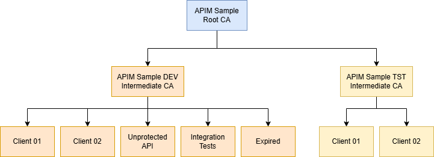

> [!WARNING]  
> This repository intentionally includes self-signed certificates (including private keys) **for local development and demo/template convenience only**.
> In real-world scenarios, **never** commit certificates with private keys to source control.
> Use proper secret/certificate management and generate certificates as part of your secure environment/tooling.
> We included these files here to keep this template easy to use without adding an extra dependency on certificate generation tools (for example, OpenSSL).

---

# Self Signed Certificates

The script [generate-client-certificates.ps1](./generate-client-certificates.ps1) can be used to generate the following self-signed certificate tree.



- **APIM Sample Root CA**: is the root CA for this sample
  - **APIM Sample DEV Intermediate CA**: is intermediate CA for a 'dev' environment
    - **Valid Client**: is registered in API Management as a valid client
    - **Unregistered Client**: is NOT registered in API Management and should be blocked when explicitly checking client certificates
    - **Unprotected API**: is used when the Unprotected API calls the Protected API using mTLS
    - **Expired**: is an expired certificate for testing purposes
    - **Not Yet Valid**: is a certificate that is valid in the future and used for testing purposes
  - **APIM Sample TST Intermediate CA**: is intermediate CA for a 'test' environment
    - **Untrusted Client**: can be used to test what happens when certificates from an untrusted intermediate CA are used

See the [certificates](./certificates) folder for the generated certificates. The `.pfx` files are password protected with the password `P@ssw0rd`. They are valid until `May 14, 2076`, except for the Expired certificate.

## Generate certificates

To (re)generate the certificate tree yourself, run the script from this folder:

```powershell
./generate-client-certificates.ps1
```

If you run the script without parameters, it prompts for a password. This password is used when exporting the `.pfx` certificate files.

You can also provide the password explicitly:

```powershell
./generate-client-certificates.ps1 -CertificatePassword (Read-Host "Certificate password" -AsSecureString)
```

If you generate the certificate tree with a different password, make sure to update [/infra/01-core/hooks/core-postprovision-import-certificates.ps1](../infra/01-core/hooks/core-postprovision-import-certificates.ps1).
